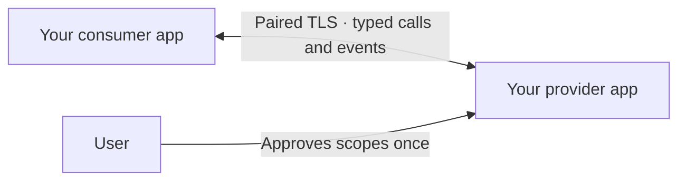

# Talk.swift

**Let your macOS apps work together.**

Talk is a Swift SDK for app-to-app communication: expose typed actions and live events in one app, call them from another, and let users approve exactly what each integration can do. Pair once; subsequent permitted automation uses the saved grant.

Built for macOS developers adding integrations to their apps, and for coding agents helping implement them. A focus app can switch a workspace app's scene, a companion utility can query another app's state, or two apps can react to each other's changes.

> **Beta — use with caution.** Talk still needs more testing and validation. APIs and behavior can change. Evaluate it with synthetic or noncritical data, and validate your actual signed apps before relying on an integration. This beta is not a production-readiness or security guarantee.

The declared runtime minimum is **macOS 12.4**; actual Monterey runtime validation is pending. Current native validation covers macOS 15.7.9 on Apple silicon with Apple Development signing. Distribution signing, unrelated developer teams, additional platforms, and independent security review remain open. See [status and qualification](Docs/BETA-READINESS.md).

## What you get

- **Typed contracts:** declare actions, scopes, DTOs, and events in JSON; generate Swift clients with the included SwiftPM plugin.
- **Explicit permissions:** first-use provider consent, independent saved grants, permission replacement, and per-integration revocation.
- **Local transport:** TLS 1.3 with paired-key authentication over loopback, using Apple frameworks. No cloud service, shared daemon, or third-party runtime dependencies.
- **Protected credentials:** each app stores its own grants in its app-specific data-protection Keychain group.
- **Calls and live events:** compatibility negotiation, bounded queues, cancellation, and snapshot-based resubscription.
- **Runnable examples and an LLM skill:** learn the complete flow or bring the integration workflow into your coding agent.



Pairing proves possession of the paired credential. Displayed app names and bundle IDs are routing hints, not verified publisher identities. Mutations are never automatically replayed after a timeout or disconnect; their outcome may be uncertain. Events are live delivery without durable replay. Read the [security model](Docs/SECURITY-NOTES.md) before designing your integration.

## Install

Requires **Swift 6.2+** and a compatible macOS toolchain. The tested toolchain is Xcode 26.2 / Swift 6.2.3. Saved pairing requires correctly Apple-signed and provisioned app targets; an unsigned command-line build alone cannot validate persistence.

In Xcode, add this package URL, select the `main` branch, and link the **Talk** product to each participating app:

```text
https://github.com/AppitStudio/Talk.swift.git
```

For a Swift package:

```swift
dependencies: [
    .package(url: "https://github.com/AppitStudio/Talk.swift.git", branch: "main")
]
```

Then add `.product(name: "Talk", package: "talk.swift")` to your target's dependencies and `import Talk`. There is no tagged stable release yet; pin a reviewed commit for reproducible integration work.

The [installation guide](Docs/INSTALLATION.md) covers a complete package manifest, local development, signing, sandbox capabilities, and generated contract targets.

## Integrate two apps

1. **Define a contract.** Give actions and events stable IDs, narrow permission scopes, and concrete DTOs. Generate the shared Swift contract/client module.
2. **Implement the provider.** Bind actions to app behavior, restore saved grants at startup, and present visible scoped consent for new pairing.
3. **Implement the consumer.** Save the approved grant, resolve the provider, and use the generated client from your app's actual automation trigger.
4. **Own the lifecycle.** Handle live events, disconnects, uncertain mutation outcomes, permission replacement, revocation, and protected-storage recovery.
5. **Validate the signed apps.** Test permitted and denied operations, restart, cold launch, and durable revocation in your actual app pair.

Start with the [end-to-end integration guide](Docs/INTEGRATION-GUIDE.md). It includes typechecked provider and consumer code drawn from the runnable examples.

| Guide | Use it for |
| --- | --- |
| [Installation](Docs/INSTALLATION.md) | Xcode / SwiftPM setup, signing, and sandbox requirements |
| [Integration](Docs/INTEGRATION-GUIDE.md) | Provider handlers, pairing, clients, events, and lifecycle |
| [Contracts](Docs/CONTRACTS.md) | Supported types, code generation, and directional compatibility |
| [Example apps](Docs/EXAMPLES.md) | Build and pair Talk Studio and Talk Automator |
| [LLM-assisted integration](Docs/LLM-INTEGRATION.md) | Install the skill and use it in an existing app project |
| [Credential lifecycle](Docs/CREDENTIAL-LIFECYCLE.md) | Updates, storage ownership, revocation, and recovery |
| [Security model](Docs/SECURITY-NOTES.md) | Trust boundaries, permissions, and resource limits |

## Use with a coding agent

The repository includes the portable [talk-integrations skill](Skills/talk-integrations/SKILL.md), its references, a compilable starter, and a read-only signed-bundle validator.

After [installing the skill](Docs/LLM-INTEGRATION.md), invoke it in your app project:

```text
$talk-integrations Add a Talk integration between my workspace app (provider)
and focus app (consumer). Expose reading and selecting scenes, plus scene-change
events. Starting a focus session should select the Focus scene. Use the Talk.swift
checkout I provide and validate pairing, saved consent, restart, and revocation.
```

The skill supports provider-only, consumer-only, or both-role work. Other coding agents can read its `SKILL.md` and linked resources directly.

## Build and contribute

```sh
git clone https://github.com/AppitStudio/Talk.swift.git
cd Talk.swift
swift test --disable-xctest
swift build -c release
python3 Scripts/validate-contract-pipeline.py
python3 Scripts/validate-integration-guide.py
python3 Scripts/validate-integration-skill.py
```

Tests use synthetic data. The [example app guide](Docs/EXAMPLES.md) explains the separate signing setup needed for persistent pairing. The skill validator reports static checks; it does not replace actual-app testing.

Read [contributing](CONTRIBUTING.md) for validation and preview compatibility expectations. Report vulnerabilities through [the private security reporting process](SECURITY.md).

## License

A license has not been selected yet. This public beta currently has no license grant; license selection is pending.
